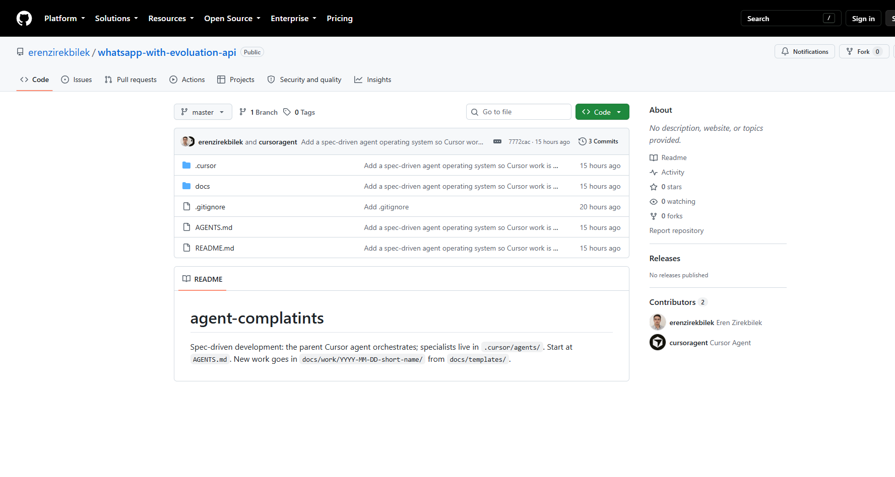
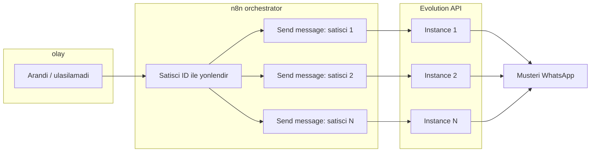
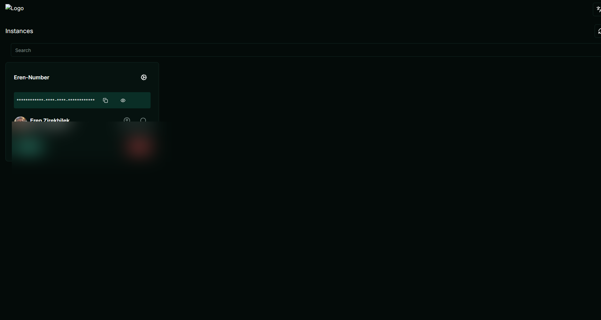
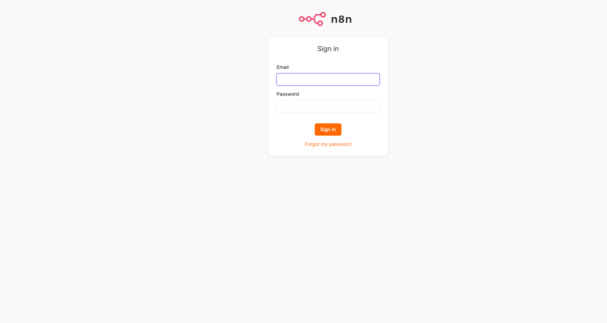

# WhatsApp with Evolution API

Depo: [github.com/erenzirekbilek/whatsapp-with-evoluation-api](https://github.com/erenzirekbilek/whatsapp-with-evoluation-api)

Satış ekibinin **kendi WhatsApp hesaplarından**, n8n üzerinden otomatik mesaj atmasını sağlar. Tipik senaryo: müşteri arandı, **ulaşılamadı** → o satışçının WhatsApp’ından kısa bir takip mesajı gider. Müşteri QR okutmaz; gördüğü numara satışçının numarasıdır.

Bu repo üç şeyi bir arada tutar: Evolution (WhatsApp oturumları), n8n örnek workflow’lar ve şirket senaryosunun yazılı tarifi.

## Bu repo ne işe yarar?

| Parça | Görevi |
|--------|--------|
| **Evolution API** (Docker) | Her satışçının WhatsApp’ını bir *instance* olarak açık tutar, `sendText` ile mesaj iletir. |
| **n8n** | Orchestrator: “kim aradı, kime yazılacak, hangi metin” kararını verir; doğru instance’a HTTP atar. |
| **Doküman + örnek JSON** | Ulaşılamadı senaryosunu ve örnek workflow’u açıklar; API anahtarı dosyada tutulmaz. |

Local kurulum (pilot): [infra/evolution/README.md](infra/evolution/README.md). Senaryo metni: [docs/missed-reach-orchestration.md](docs/missed-reach-orchestration.md).

## Mimari

n8n içeride **ayrı send-message hatları** tutar (örnek: 10 satışçı = 10 dal). Her dal bir Evolution instance adına gider. Karışık hat olmasın diye Ayse’nin olayı Mehmet’in WhatsApp’ından çıkmaz.

1. Dış sistem (CRM, santral veya form) n8n’e “ulaşılamadı” olayını yollar: satışçı kimliği + müşteri numarası.
2. n8n Switch ile **yalnızca o satışçının** dalını çalıştırır.
3. HTTP `POST .../message/sendText/{instanceAdi}` — n8n Docker’dan Evolution’a `http://host.docker.internal:8080`.
4. Evolution, o instance’ın bağlı telefonundan mesajı iletir.

n8n **metni ve kime** yazılacağını bilir. Evolution **oturumu** tutar. Personel bir kez QR ile bağlanır.

### Ekranlar

Evolution Manager: instance listesi. Her kart bir satışçı hattı (bağlı / kopuk). Aşağıdaki görüntüde kişisel numara bulanık.

n8n: workflow’ların yazıldığı yer. Giriş ekranı:

Örnek orchestrator (import): [infra/evolution/workflows/missed-reach-orchestrator.json](infra/evolution/workflows/missed-reach-orchestrator.json)

Auth: n8n **Header Auth**, header adı `apikey` (değer JSON’da yok).

## Agent işletim sistemi

Cursor parent agent + spec/plan alt ajanları: [AGENTS.md](AGENTS.md). İş kalemleri: `docs/work/`.
