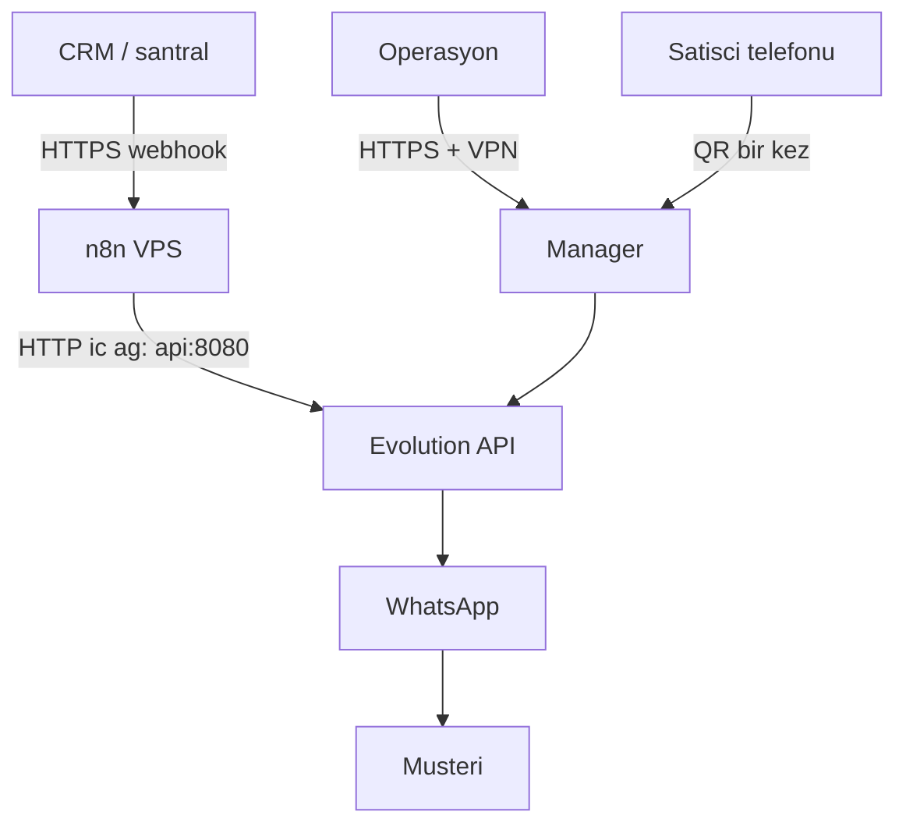

# Kurumsal kılavuz: VPS + domain + n8n (entegre)

Şirketler sistemi **dizüstü Docker** ile işletmez. Kendi **VPS**’leri, **domain**’leri ve çoğu zaman **aynı sunucuda (veya aynı özel ağda) n8n** vardır. Bu belge o hedefi anlatır. Laptop kurulumu yalnızca geliştirici kanıtıdır: [infra/evolution/README.md](../infra/evolution/README.md).

## Ne kurulur?

Tek entegre yığın:

| Bileşen | Nerede | Kim görür |
|---------|--------|-----------|
| Evolution API + Postgres + Redis | VPS, Docker | Yalnızca n8n ve (isteğe bağlı) iç panel |
| Evolution Manager | Aynı VPS, tercihen VPN / IP kısıtı | Operasyon, satışçı QR için |
| n8n | Aynı VPS veya şirket n8n host’u | Operasyon / otomasyon |
| CRM / santral webhook | İnternet → n8n HTTPS | Dış sistem |
| Domain + TLS | `evo.sirket.com`, `n8n.sirket.com` (veya path) | Sertifika, tarayıcı, webhook |

Müşteri hiçbir URL açmaz. Satışçı bir kez Manager’da QR okutur.

## Mimari (üretim)

n8n ile Evolution **aynı Docker ağındaysa** HTTP adresi `http://host.docker.internal:8080` **değildir**. Servis adı kullanılır: `http://api:8080` (bu repodaki compose’daki `api` servisi).

n8n ayrı bir VM’deyse: özel ağ IP’si veya iç DNS, örneğin `http://10.x.x.x:8080` — **8080’ü dünyaya açmayın**. Dışarı yalnızca reverse proxy (443) çıksın.

## Domain ve TLS

1. Domain şirket hesabında (Cloudflare, registrar fark etmez).
2. A kaydı VPS genel IP’sine.
3. Reverse proxy (Caddy, Nginx, Traefik): `https://evo.sirket.com` → Evolution `8080`; isteğe bağlı `https://n8n.sirket.com` → n8n `5678`.
4. Evolution `.env` içinde `SERVER_URL=https://evo.sirket.com` (iç webhook/QR için doğru public URL).
5. Manager’ı mümkünse ayrı host + IP allowlist veya Cloudflare Access / VPN arkasına alın. Global `apikey` sızdırmayın.

Cloudflare Tunnel, domain’siz dizüstü için bir seçenektir. Domain + VPS olan şirket için **klasik reverse proxy + Let’s Encrypt** daha doğrudandır.

## n8n entegrasyonu

1. Header Auth: header adı `apikey`, değer Evolution `AUTHENTICATION_API_KEY` (credential; workflow JSON’a yazılmaz).
2. Orchestrator: [missed-reach-orchestrator.json](../infra/evolution/workflows/missed-reach-orchestrator.json) — her satışçı için ayrı dal, ayrı instance adı.
3. Webhook URL’si **n8n’in production HTTPS** adresi olur (`https://n8n.sirket.com/webhook/...`). CRM bunu çağırır.
4. `sendText` URL’sindeki instance adı Evolution Manager’daki isimle birebir aynıdır.
5. n8n Cloud kullanılıyorsa Evolution yine VPS’te **public HTTPS** (veya tünel) olmadan Cloud’dan görünmez. Kurumsal varsayılan: **n8n self-host, Evolution ile aynı ağ**.

## Satışçı hatları

- Her satışçı = bir Evolution instance, bir n8n send-message dalı.
- QR, Manager üzerinden VPS’teki panele (VPN) bağlanarak okutulur; laptop şart değil.
- Instance koparsa yalnızca o satışçının otomatik mesajı durur; diğer dallar etkilenmez.

## Güvenlik (kısa)

- `.env` git’e girmez. Anahtar rotasyonu: Evolution `.env` + n8n credential.
- Evolution portunu `0.0.0.0:8080` ile internete bağlamayın; `127.0.0.1` veya yalnızca Docker ağı + proxy.
- Webhook’a mümkünse n8n header secret veya IP kısıtı.
- Yedek: Postgres + `evolution_instances` volume; VPS snapshot.

## Compose’u VPS’te

Aynı [docker-compose.yml](../infra/evolution/docker-compose.yml) kullanılır. Farklar:

- `.env`: güçlü parolalar, `SERVER_URL=https://evo.sirket.com`.
- n8n zaten sunucudaysa Evolution’ı **mevcut n8n compose ağına** bağlayın veya ortak `external` network tanımlayın; HTTP hedefi `http://api:8080`.
- `restart: unless-stopped` kalsın; VPS reboot sonrası stack ayağa kalksın.
- İzleme: disk (oturum dosyaları), RAM (WhatsApp oturumu), 7/24 uptime. VPS kapalı = mesaj yok.

## Pilot (laptop) ile fark

| | Pilot | Kurumsal |
|--|--------|----------|
| Host | Geliştirici PC | Şirket VPS |
| n8n adresi Evolution’a | `host.docker.internal:8080` | `api:8080` veya iç IP |
| Domain | Yok | Şirket domain + TLS |
| Kim kullanır | Geliştirici | Operasyon + satış + CRM |
| Süreklilik | PC uykusu keser | Sunucu SLA |

İş kuralı (ulaşılamadı → doğru satışçı WhatsApp’ı) **aynıdır**. Değişen yalnızca yerleştirme ve ağdır.
